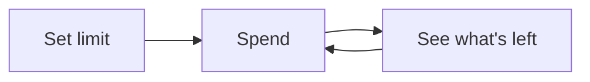

# 1Left

**Set a limit. See what's left.**

Minimalist budget tracking app for Android. No accounts, no sync, no ads - just you and your spending limit.

**Website:** [1left.app](https://1left.app)

## Problem

Every budget app wants to be your financial advisor. They demand sign-ups, sync your data, track categories, generate reports. All I needed during my student years was simple: I have €100 for a certain period, show me what's left.

## Solution

One screen. One number. No friction.

## How it works

1. Set your spending limit (weekly, monthly, or any amount)
2. Log expenses as you spend
3. See what's left at a glance

That's it.

## Features

- 🎯 Single-purpose: one limit, one balance
- 🔒 100% offline, data stays on your device
- 🎨 4 themes (Dark, Light, Ocean, Purple)
- 📋 Transaction history with timestamps
- ⚡ Instant launch, no loading screens
- ↩️ Undo right after spending (typo protection)
- 🔄 Reset limit anytime

## Download

[**Download APK**](https://github.com/kalba-lab/1left/releases/latest/download/1left-v1.0.apk)

*Google Play coming soon*

## Tech

Kotlin, Jetpack Compose, Material 3

## License

MIT
